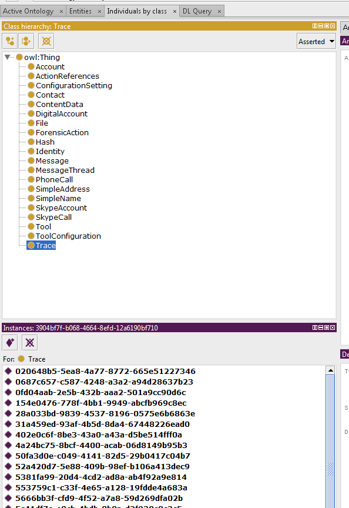
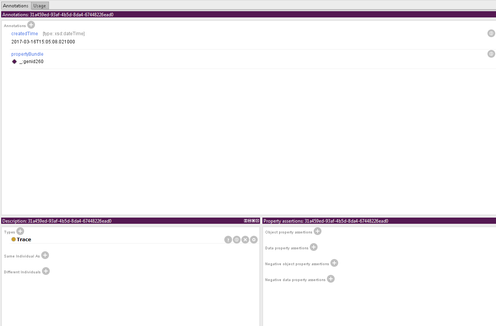
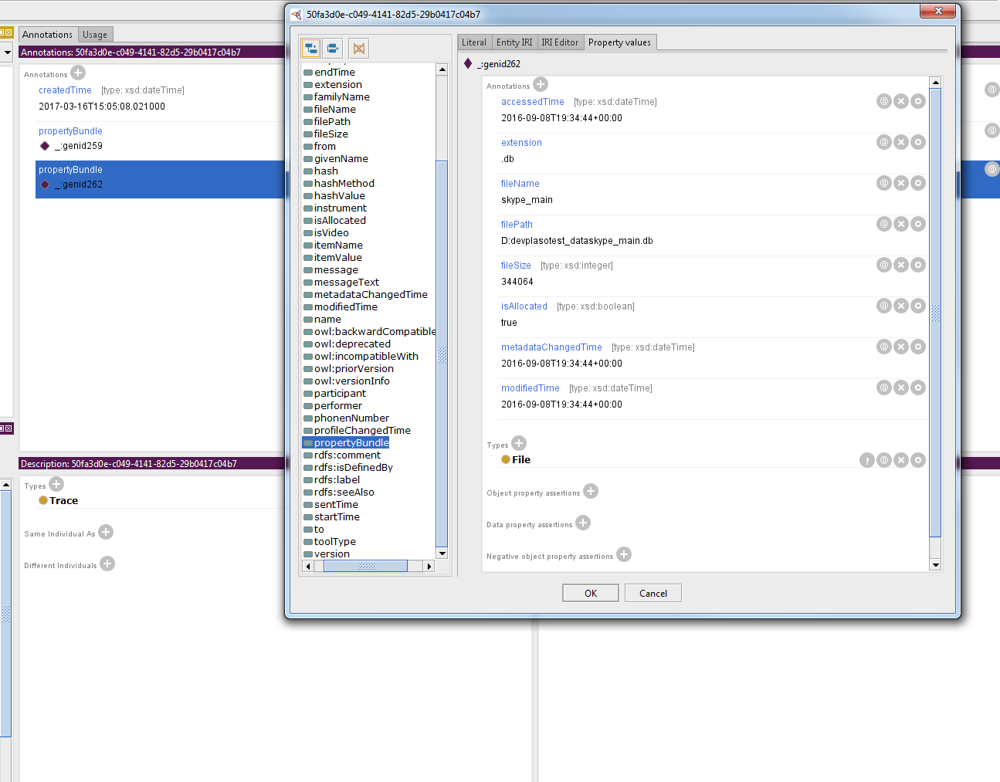
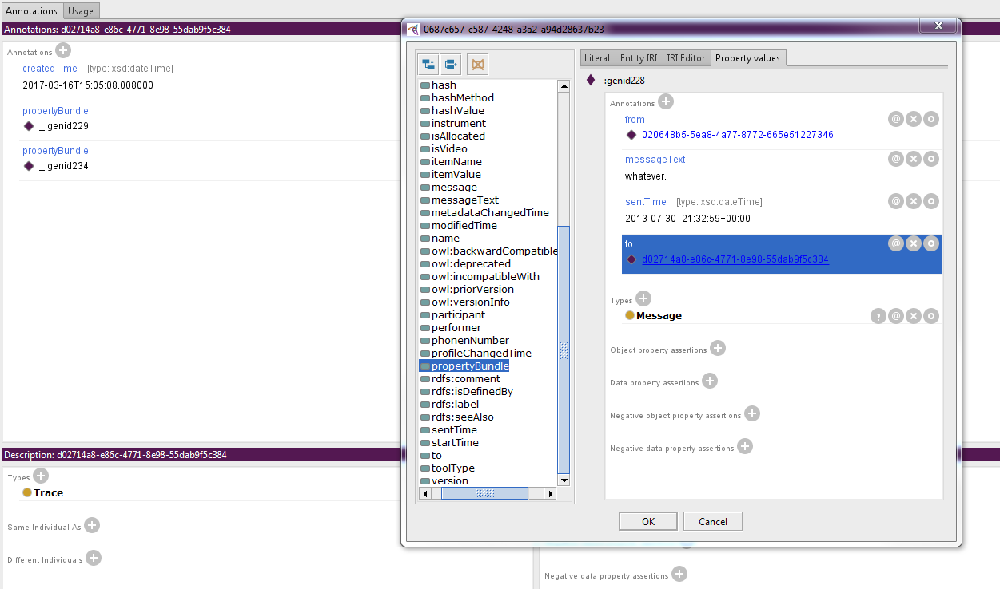
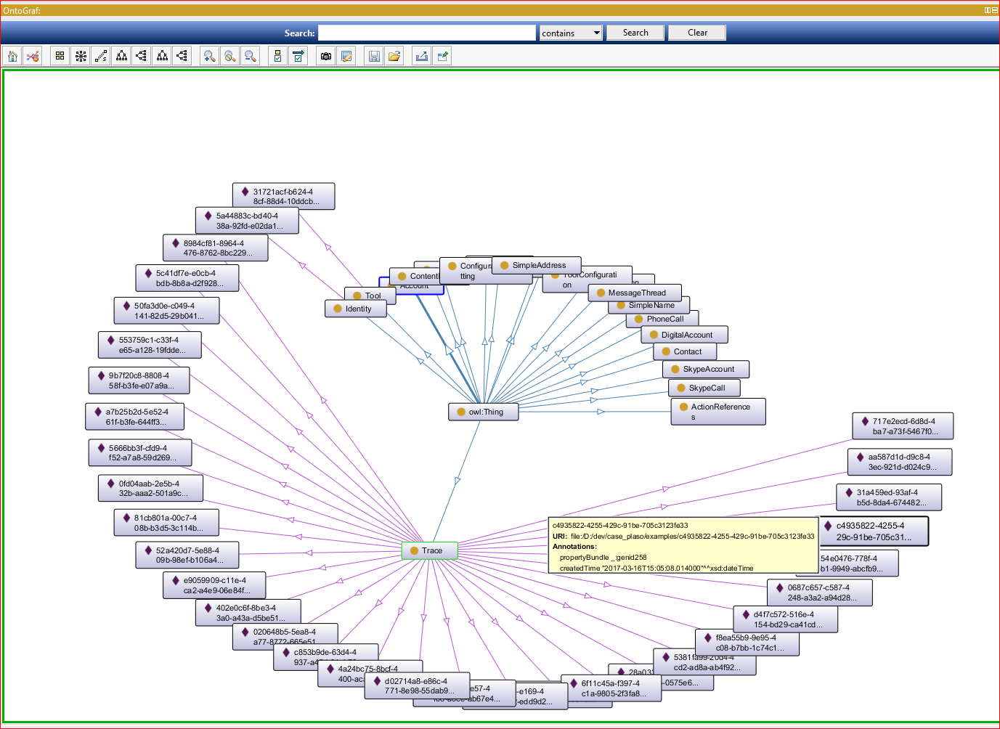

# Using Protege to view examples

In order to better traverse the examples, it is recommend to open this
data using RDF editor such as [Protege](http://protege.stanford.edu).

*Note: Protege is the easiest program I have found to view this data so far.
However, it still has its issues (like viewing and graphing blank nodes)
and is not as intuitive for someone not familiar with RDF.
If you have found a better program you recommend to view these examples,
please don't hesitate to let me know.*

## Traversing Instances
Once you have opened either the xml or ttl file for an example in the program,
go to the "Individuals by class" tab and then select either the "ForensicAction"
or "Trace" class.

From there, you will find all the instances of that class listed in the
"Instances" window.
*Note: Property bundles will not be listed here due to how this program
deals with blank nodes.*

When you click on one of these instances you find its properties listed
in the "Annotations" window. These instances usually only have a few properties
"createdTime" (the time that the object was created) and "propertyBundle" which
links to a property bundle it contains.

Properties (like "propertyBundle") that link to reference labeled "_:genid*" are known as a blank node.
These are objects that don't have an external id and can only be referenced
internally.

To view the contents of the blank nodes, double click on it to see a new window pop up containing the node's properties.
(You can continue to double click on blank nodes if there are any.)

If a property bundle contains a property to another object, you will see this as a reference containing a
uuid to another instance. If you single click on that reference, the "Annotations" window will
change to that instance.

## Viewing A Graph (somewhat)

You can view a graph of the data by going to `Window -> Tabs -> OntoGraf`.
Unfortunately, the graph does not show data contained inside of any of the property bundles.
Making it not as useful as it could be.